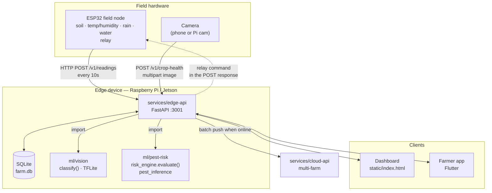

# Citadel backend integration plan

How the field node, the two AI modules, the edge backend, the dashboard, the farmer app, and the cloud connect into one data loop.

The base is already there. This document is about **collapsing duplication and wiring the seams**, not building a new backend.

---

## 1. What exists today

| Component | Path | State | Port |
| --- | --- | --- | --- |
| ESP32 field node | `firmware/esp32-field-node/field_node.ino` | Serial-only. Soil + water analog. No Wi-Fi, no relay control path. | — |
| Edge backend (Python) | `apps/dashboard/backend/` | FastAPI + SQLite. Readings, vision results, relay state, history. Serves the dashboard. | 3000 |
| Edge backend (Node) | `services/edge-api/` | In-memory. Zones, observations, irrigation approval, risk-service client, vision subprocess. | 3001 |
| Dashboard UI | `apps/dashboard/static/index.html` | Live. Calls `window.location.origin` — same-origin as the Python backend. | — |
| Dashboard UI (dup) | `apps/dashboard/src/server.js` | Second HTML dashboard, points at the Node API. Has a syntax error. | 3000 |
| Crop-health AI | `ml/vision/src/inference.py` | TFLite MobileNetV2, 5 tomato classes + quality gate. **CLI only** — argv in, JSON on stdout. | — |
| Pest + risk AI | `ml/pest-risk/src/` | Pure-Python rule engine (`risk_engine.py`) + TFLite SSD adapter + its own FastAPI. | 8001 |
| Farmer app | `apps/farmer-app/` | Flutter. Complete UI, wired to `MockFarmStateRepository`. | — |
| Cloud API | `services/cloud-api/` | 12-line placeholder. | 3002 |
| Contracts | `packages/contracts/src/events.js` | JS-only shapes. Consumed by nothing that survives consolidation. | — |

### The core problem: the advisory rules exist three times

The same irrigation / heat / flood / disease thresholds are implemented in:

1. `apps/dashboard/backend/advisory_engine.py`
2. `services/edge-api/src/advisory.js` → `buildFallbackAdvisories`
3. `ml/pest-risk/src/risk_engine.py`

Three copies means three different answers the first time someone tunes a threshold. And two backends means two databases, two ports, and two versions of "what is the farm doing right now".

---

## 2. Target architecture

**One backend. One database. One port. Rules in one file.**



### The four decisions that make this work

**a. `services/edge-api` becomes the FastAPI app; the Node one is deleted.**

Move `apps/dashboard/backend/` into `services/edge-api/`, delete the Node source, and change the port to **3001**. Port 3001 is what every existing consumer already expects — `AppConstants.defaultEdgeApiUrl` ([app_constants.dart:6](apps/farmer-app/lib/core/constants/app_constants.dart:6)), `EDGE_API_URL` in [config.example.h](firmware/esp32-field-node/config.example.h), and `docs/demo.md`. Pick 3001 and nothing else needs editing.

Keep the Python side because it already has the thing the Node README itself asks for: *"replace the in-memory store with SQLite before field testing."* It's done. Port the four features the Node API has and Python doesn't (below), then delete `services/edge-api/src/*.js` and `apps/dashboard/src/server.js`.

The dashboard stays where it is and keeps being served same-origin by FastAPI's `StaticFiles` mount, so `API_BASE = window.location.origin` ([index.html:229](apps/dashboard/static/index.html:229)) keeps working untouched.

**b. `risk_engine.py` is the only advisory implementation.**

Delete `advisory_engine.py` and `advisory.js`. The backend imports the engine:

```python
from ml.pest_risk.src.risk_engine import evaluate
from ml.pest_risk.src.schemas import SensorReading, PestObservation
from ml.pest_risk.src.profiles import get_profile
```

`risk_engine.evaluate()` wins because it has no third-party imports, keeps thresholds in swappable `CropRiskProfile` objects, and attaches an `evidence` dict to every advisory — so the app can show *why* it said that. The other two hardcode their numbers inline.

Install the ML packages into the edge venv as editable local packages (add a `pyproject.toml` to each of `ml/vision` and `ml/pest-risk`, then `pip install -e ml/vision -e ml/pest-risk`) so the imports are real packages, not `sys.path` surgery.

**c. AI is imported in-process, not called over HTTP or spawned as a subprocess.**

Backend and both AI modules are Python on the same box. The current `execFileAsync('.venv/bin/python', ['-m','src.inference', tmp])` in the Node API pays process startup + TensorFlow import (~2–4s) on *every scan*, is cwd-dependent, and parses the last line of stdout. Importing removes all of it.

`inference.py` needs one small refactor — extract the body of `main()` into a reusable function and leave the CLI as a wrapper:

```python
# ml/vision/src/inference.py
from functools import lru_cache

@lru_cache(maxsize=1)          # load the interpreter once per process
def _interpreter():
    interp = tf.lite.Interpreter(model_path=MODEL_PATH)
    interp.allocate_tensors()
    return interp

def classify(image_path: str) -> dict:
    """Everything main() used to do, returning the result dict."""
    ...

def main():                     # CLI preserved for ML-side testing
    print(json.dumps(classify(sys.argv[1])))
```

`ml/pest-risk/src/api.py` (port 8001) stays as-is for standalone model testing, but it is **not in the request path**. `risk_engine` and `pest_inference` are imported directly. Same for the `RISK_SERVICE_URL` fallback dance — it disappears, because an in-process call can't be unreachable.

**d. SQLite is the interconnect.**

Every module writes to the same file and joins on `zone_id` + time. That is the whole "all data is interconnected" mechanism — no message bus, no separate stores to reconcile. An observation is stitched to the environmental conditions at the moment it was captured via `reading_id`, so the pest engine sees leaf evidence *and* humidity in one query.

---

## 3. Data model

Replaces the current four tables. Additions marked ✚.

```sql
CREATE TABLE readings (
  id                INTEGER PRIMARY KEY AUTOINCREMENT,
  event_id          TEXT UNIQUE NOT NULL,  -- ✚ device-generated UUID: retry dedup + cloud idempotency
  device_id         TEXT NOT NULL,
  zone_id           TEXT NOT NULL,
  soil_moisture_pct REAL,
  temperature_c     REAL,                  -- ✚ nullable: NULL = sensor absent or failed
  humidity_pct      REAL,                  -- ✚ nullable
  rainfall_mm       REAL,
  water_level_pct   REAL,
  relay_reported    TEXT,                  -- ✚ relay state the node confirms it is in (the ack)
  captured_at       TEXT NOT NULL,         -- device clock; drifts, may be absent before NTP
  received_at       TEXT NOT NULL,         -- ✚ server clock; authoritative for ordering
  synced_at         TEXT                   -- ✚ NULL = still owed to the cloud
);
CREATE INDEX idx_readings_zone_time ON readings(zone_id, received_at DESC);

-- ✚ replaces `vision_results`: one shape for both AI modules, `kind` discriminates
CREATE TABLE observations (
  id            INTEGER PRIMARY KEY AUTOINCREMENT,
  event_id      TEXT UNIQUE NOT NULL,
  kind          TEXT NOT NULL,             -- 'crop_health' | 'pest'
  zone_id       TEXT NOT NULL,
  crop          TEXT,
  label         TEXT NOT NULL,
  confidence    REAL NOT NULL,
  count         INTEGER DEFAULT 1,         -- pest instances; 1 for classification
  image_quality TEXT,
  limitation    TEXT,                      -- ✚ why a result is weak; the app must show this
  reading_id    INTEGER REFERENCES readings(id),  -- ✚ environmental context at capture time
  captured_at   TEXT NOT NULL,
  received_at   TEXT NOT NULL,
  synced_at     TEXT
);

-- ✚ desired vs reported: the backend never assumes a command took effect
CREATE TABLE actuator_state (
  actuator_id    TEXT PRIMARY KEY,
  zone_id        TEXT NOT NULL,
  desired_state  TEXT NOT NULL,            -- what the backend wants
  reported_state TEXT,                     -- what the node last confirmed
  desired_at     TEXT NOT NULL,
  reported_at    TEXT
);

-- ✚ the human approval gate (ported from the Node API's in-memory version)
CREATE TABLE irrigation_requests (
  id           TEXT PRIMARY KEY,
  zone_id      TEXT NOT NULL,
  requested_by TEXT NOT NULL,
  status       TEXT NOT NULL,              -- 'pending' | 'approved' | 'declined' | 'expired'
  approved_by  TEXT,
  created_at   TEXT NOT NULL,
  approved_at  TEXT,
  synced_at    TEXT
);

CREATE TABLE actuator_logs (               -- unchanged: append-only audit
  id           INTEGER PRIMARY KEY AUTOINCREMENT,
  actuator_id  TEXT NOT NULL,
  zone_id      TEXT NOT NULL,
  action       TEXT NOT NULL,
  status       TEXT NOT NULL,
  requested_by TEXT NOT NULL,
  timestamp    TEXT NOT NULL,
  synced_at    TEXT
);
```

**Why advisories are not a table.** They are a pure function of `(reading, observations, profile)`. Storing them means they can go stale against the reading they describe. Compute on read; if you later need "what did we tell the farmer on Tuesday", add an `advisory_log` written only when an advisory is *delivered* as a notification.

**Enable WAL** — `PRAGMA journal_mode=WAL` — so the ESP32's writes don't block dashboard reads.

---

## 4. API contract

Base `http://<edge-host>:3001`. FastAPI publishes the authoritative schema at `/openapi.json`; that replaces `packages/contracts`.

| Method | Path | Producer → Consumer | Notes |
| --- | --- | --- | --- |
| `GET` | `/health` | all | Add `lastDeviceContact`, `modelStatus`, `pendingSyncCount`. The app's settings screen already pings this. |
| `GET` | `/v1/zones` | UI | ✚ port from Node API |
| `GET` | `/v1/farm-state?zoneId=` | backend → app, dashboard | reading + observations + advisories + relay state + freshness |
| `GET` | `/v1/history?zoneId=&limit=` | backend → UI | for charts |
| `POST` | `/v1/readings` | **ESP32** → backend | **returns the relay command** — see §5 |
| `POST` | `/v1/crop-health` | app/camera → backend | multipart image → `ml/vision.classify()` |
| `POST` | `/v1/pest/analyze` | app/camera → backend | multipart image → `pest_inference` |
| `POST` | `/v1/observations` | AI → backend | ✚ direct result injection, for testing and external models |
| `POST` | `/v1/irrigation/requests` | app/dashboard → backend | ✚ records intent; **not** a pump command |
| `POST` | `/v1/irrigation/requests/{id}/approve` | app/dashboard → backend | ✚ approval sets `desired_state = 'ON'` |
| `POST` | `/v1/actuator-command` | dashboard → backend | manual override; always audited |
| `POST` | `/v1/sync/batch` | edge → **cloud** | see §7 |

### `GET /v1/farm-state` response

```jsonc
{
  "status": "ok",
  "mode": "offline-first-edge",
  "zoneId": "zone-a",
  "reading": { "deviceId": "field-node-01", "soilMoisturePct": 22.4, "temperatureC": 39.1,
               "humidityPct": 32.0, "rainfallMm": 0, "waterLevelPct": 8,
               "capturedAt": "...", "receivedAt": "..." },
  "freshness": "live",                    // live | stale | offline — server-computed
  "observations": [ { "kind": "crop_health", "label": "early_blight", "confidence": 0.82,
                      "imageQuality": "acceptable", "limitation": null, "capturedAt": "..." } ],
  "advisories": [ { "type": "irrigation", "severity": "warning", "title": "Irrigate now",
                    "message": "...", "action": "REVIEW_IRRIGATION",
                    "evidence": { "soilMoisturePct": 22.4, "temperatureC": 39.1 } } ],
  "actuator": { "actuatorId": "pump-relay-01", "desiredState": "OFF",
                "reportedState": "OFF", "inSync": true },
  "pendingIrrigationRequests": []
}
```

`freshness` is computed server-side from `received_at`, not client-side. The app currently derives it from its own last *fetch* time ([farm_state_repository.dart](apps/farmer-app/lib/data/repositories/farm_state_repository.dart)) — which reports "live" when the backend is answering promptly with hours-old sensor data. A successful fetch of stale data is not fresh data.

---

## 5. IoT: how the hardware joins the loop

### Uplink — ESP32 → backend

Plain HTTP POST to `/v1/readings` over the farm Wi-Fi. `config.example.h` already declares `EDGE_API_URL`, so the shape is chosen; only the code is missing.

**No MQTT broker.** For one node, MQTT adds a broker process, a topic scheme, and a QoS/retain discussion to move one JSON object every 10 seconds. HTTP is already in the config and already parsed by the backend. Revisit when either is true: more than ~5 nodes, or a second consumer needs the same reading in real time without polling the backend.

### Downlink — backend → ESP32, riding the response

The node already contacts the backend every 10 seconds. So the relay command travels back in the reply to the reading it just posted:

```jsonc
// 201 response to POST /v1/readings
{ "reading": { "id": 4821, "receivedAt": "..." },
  "command": { "actuatorId": "pump-relay-01", "relayState": "ON", "maxRuntimeSec": 900 } }
```

No broker, no second endpoint, no long poll, no inbound port on the node. Worst-case command latency is one reporting interval — irrelevant for irrigation.

The node applies `relayState`, then reports what it actually did in `relay_reported` on its **next** POST. That closes the loop: `desired_state != reported_state` for more than two intervals is a fault, and the dashboard should say so rather than showing the state the backend merely *wishes* were true.

`maxRuntimeSec` is a **dead-man switch**: the node stops the pump when the timer expires even if the backend never speaks again. If the Pi crashes mid-irrigation, the pump stops on its own. Without this, a backend crash floods the field.

### Firmware loop

```c
void loop() {
  Reading r = sampleSensors();
  r.relayReported = relayIsOn() ? "ON" : "OFF";
  r.eventId       = uuid();                 // stable across retries

  if (wifiUp() && postReading(r, &cmd)) {
    applyRelay(cmd.relayState, cmd.maxRuntimeSec);
    flushQueue();                            // drain buffered readings, oldest first
  } else {
    bufferToNVS(r);                          // ring buffer in flash; sensing never stops
  }

  enforceRuntimeLimit();                     // dead-man switch, runs every loop
  delay(REPORT_INTERVAL_MS);
}
```

`event_id` is the same on every retry of a given sample, and `readings.event_id` is `UNIQUE` — so a reading that was actually stored but whose response was lost gets rejected as a duplicate instead of being counted twice.

### Calibration knobs — do not skip these

Sensors are not their datasheets, and the current `asPercent()` ([field_node.ino:8](firmware/esp32-field-node/field_node.ino:8)) has no room for reality:

- **Soil moisture** needs per-sensor dry/wet ADC endpoints in `config.h`, not a hardcoded `4095 → 0` span. Capacitive and resistive probes read in opposite directions; the current mapping is inverted for one of them. Calibrate against oven-dry soil and saturated soil per probe.
- `map()` is integer arithmetic, so the `%.1f` in the serial output is fake precision. Convert as float or stop printing a decimal.
- **Median-of-5 samples** per reading. Raw ADC on a long cable in a field is noisy, and a single spike currently becomes an advisory.
- **Relay polarity.** `digitalWrite(RELAY_PIN, LOW)` ([field_node.ino:13](firmware/esp32-field-node/field_node.ino:13)) is only safe on an active-HIGH board. Most cheap relay modules are active-LOW — on those, this **energises the pump at boot**. Put `RELAY_ACTIVE_LOW` in `config.h` and verify with a meter before connecting a pump.
- **Water level** on a rain-exposed analog pin drifts with corrosion. Log raw ADC alongside the percentage so drift is diagnosable later.

---

## 6. Wiring the clients

### Farmer app

The seam is already built. `FarmStateRepository` is abstract ([farm_state_repository.dart](apps/farmer-app/lib/data/repositories/farm_state_repository.dart)) with the mock behind it. Integration is **one new file**:

```dart
// lib/data/repositories/http_farm_state_repository.dart
class HttpFarmStateRepository implements FarmStateRepository {
  final String baseUrl;          // from shared_preferences, set in the settings screen
  Future<FarmState> getFarmState() async { /* GET /v1/farm-state?zoneId= */ }
  Future<CropHealthResult> submitImage(File image) async { /* multipart POST /v1/crop-health */ }
  Future<void> approveIrrigation(String action, {required bool approved}) async {
    /* POST /v1/irrigation/requests then .../approve */ }
}
```

Then swap one line in `main.dart` — `FarmStateProvider(MockFarmStateRepository())` → `FarmStateProvider(HttpFarmStateRepository(...))`. Keep the mock; it's how the UI gets worked on without a Pi on the desk.

Also needed:

- `FarmState.fromJson` must parse `observations`, `actuator`, and `freshness` — it currently reads only `reading` and `advisories`.
- Cache the last good `farm-state` JSON in `shared_preferences`. Offline-first means the app opens to Tuesday's reading clearly labelled stale, not to a spinner.
- `approveIrrigation`'s `approved: false` path needs a decline endpoint or it silently discards the farmer's "no".

### Dashboard

No changes. Same-origin already, and the backend keeps serving `static/index.html`. Delete `apps/dashboard/src/server.js`.

---

## 7. Cloud sync

The edge is authoritative; the cloud is a replica for multi-farm views.

**Push-only, batched, idempotent.** A background task inside the edge API wakes every N minutes, selects rows with `synced_at IS NULL` (oldest first, capped per batch), POSTs them to `/v1/sync/batch`, and stamps `synced_at` only on a 2xx.

```jsonc
POST /v1/sync/batch
{ "farmId": "farm-001", "readings": [...], "observations": [...],
  "irrigationRequests": [...], "actuatorLogs": [...] }

// 200
{ "accepted": ["evt-uuid-1", "evt-uuid-2"], "rejected": [] }
```

Idempotency is `event_id` uniqueness on the cloud side too, so a retry after a lost response is a no-op. That's the entire conflict-resolution story: the cloud never writes farm state back, so there are no conflicts to resolve.

Rewrite `services/cloud-api` in **Python/FastAPI** — it can then import the same `schemas.py` the edge uses, which is what keeps the two ends from drifting. Postgres, auth, and multi-tenant separation belong here, not on the Pi.

---

## 8. Integration blockers to fix first

These break the loop as written today.

1. **Firmware payload fails backend validation.** The node sends only `deviceId`, `soilMoisturePct`, `waterLevelPct` ([field_node.ino:20](firmware/esp32-field-node/field_node.ino:20)), but `temperatureC` and `humidityPct` are required fields ([schemas.py:8](apps/dashboard/backend/schemas.py:8)) → the very first real POST is a `422`. Make both nullable (per §3) and have `risk_engine` skip rules whose inputs are missing, rather than treating an absent sensor as `0`. A missing thermometer must not read as 0 °C.

2. **Advisory `type` values don't match what the app renders.** The engines emit `crop_health` and `disease_risk`; `advisory_card.dart` switches on `disease` ([advisory_card.dart:90](apps/farmer-app/lib/widgets/advisory_card.dart:90)) and `AppConstants` declares `typeDisease = 'disease'`. Those advisories fall through to a default icon. Freeze the vocabulary — `irrigation`, `heat`, `flood`, `pest`, `crop_health`, `disease_risk` — in `risk_engine` and mirror it in the app.

3. **Two `zoneId` semantics.** The Node API filters everything by zone; the Python API stores `zone_id` but ignores it on read. Add the filter, or the second zone silently shows the first zone's data.

4. **`captured_at` is device time.** Before NTP the ESP32 has no clock, so `capturedAt` is absent or wrong, and `ORDER BY id DESC` is the only thing keeping history coherent. Add `received_at` and order by it. Keep `captured_at` for drift diagnosis.

5. **`apps/dashboard/src/server.js` has unbalanced parentheses** in the `alerts.replaceChildren(...)` line and won't run. It's being deleted — don't debug it.

---

## 9. Build order

| Step | Work | Done when |
| --- | --- | --- |
| 1 | Move `apps/dashboard/backend` into `services/edge-api/`; port to 3001; delete Node `src/*.js` and `apps/dashboard/src/server.js` | Dashboard loads from `:3001`; one process runs |
| 2 | Apply the §3 schema; add WAL, `event_id`, `received_at`, `synced_at` | Migration runs on an existing `farm.db` |
| 3 | Delete `advisory_engine.py`; import `risk_engine.evaluate` | Thresholds live in `profiles.py` only |
| 4 | Refactor `inference.py` → `classify()`; import both AI modules; add `POST /v1/crop-health` | Image upload returns a label with no subprocess |
| 5 | Port zones, observations, irrigation request/approve; add `freshness` and `desired`/`reported` | `curl` reproduces `docs/demo.md` against `:3001` |
| 6 | `HttpFarmStateRepository` + extend `FarmState.fromJson` + response caching | App shows live edge data and survives airplane mode |
| 7 | Firmware: Wi-Fi, `event_id`, NVS buffering, relay downlink, dead-man switch, calibration constants | Unplug the Pi mid-irrigation → pump stops on its own |
| 8 | `services/cloud-api` in FastAPI + `/v1/sync/batch` + the edge push task | Kill the network for an hour; readings arrive once, not twice |

Steps 1–5 are backend-only and unblock 6 and 7, which can then run in parallel. Step 8 is independent of all of it.

### What this deletes

`services/edge-api/src/*.js` · `apps/dashboard/src/server.js` · `apps/dashboard/backend/advisory_engine.py` · `packages/contracts/` (superseded by `/openapi.json` + shared `schemas.py`) · the `RISK_SERVICE_URL` fallback path · the vision subprocess bridge · one of the two databases · one of the two ports.

Net: fewer moving parts than the current base, with the hardware loop actually closed.
