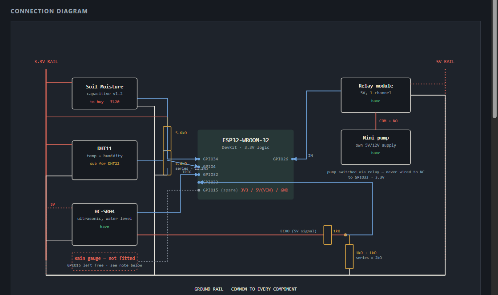

# Field Node — Build Progress & Backend Connection Guide

> Picks up where today's wiring session left off. Read this before touching hardware again tomorrow.

---

## 0. Circuit diagram

We don't have this exact 38-pin ESP32 in a Tinkercad-style simulator, so this is a hand-drawn schematic built specifically for your actual kit (DHT11 substitution, 1kΩ×3 divider, no rain gauge) rather than a Tinkercad export — same purpose, same level of detail you'd want for a PPT slide.

- **Interactive version:** [field-node-wiring-diagram.html](field-node-wiring-diagram.html) (open in a browser, or the published link shared earlier in this conversation)



*(This PNG is a rendered snapshot of the page above — use it directly in your PPT, or re-render a fresh one from the HTML if the wiring status table changes later.)*

---

## 1. Current hardware status

| Component | Status | Wired to | Notes |
|---|---|---|---|
| ESP32-WROOM-32 (38-pin DevKit) | ✅ Wired via loose female-to-female/male-to-female jumpers | — | Too wide for the breadboard's own rows — **not seated in the breadboard**, jumpered directly pin-to-pin instead. This is intentional, not a workaround to fix later. |
| DHT11 (blue breakout, pins G/V/D) | ✅ Wired and confirmed working | V→3V3, G→GND, D→D4 | Breakout has built-in pull-up — no external resistor used. Live readings: ~28°C, ~78% humidity. |
| HC-SR04 ultrasonic | ✅ Wired and confirmed working | VCC→5V row, GND→GND rail, TRIG→D32, ECHO→ voltage divider→D33 | `sensorStatus.ultrasonic: "ok"` confirmed in Serial Monitor. `waterLevelPct` reads 0 when nothing is in range — normal. |
| ECHO voltage divider | ✅ Built from 3× 1kΩ resistors | ECHO→R1(1kΩ)→junction→D33; junction→R2+R3(1kΩ+1kΩ series=2kΩ)→GND | Reproduces the spec's 1kΩ+2kΩ ratio exactly. |
| Relay module (control side) | ✅ Wired | +5V→5V row, GND→GND rail, I/P→D26 | Relay clicks correctly; GPIO26 held LOW on boot (pump off by default). |
| Relay module (load side) / pump | ⏸ Not wired | — | Decided to skip pump wiring for now — demo doesn't require it. Relay's NO/COM/NC terminals are unlabeled on this board; if revisited later, identify NO via a boot-test (pump should stay off until GPIO26 goes HIGH) since no multimeter is available. |
| Soil moisture sensor (capacitive v1.2) | ❌ Not purchased yet | Reserved: GPIO34 | Firmware already reads GPIO34 — currently floating, reports a meaningless ~100%. Wire VCC→3.3V, GND→GND, AOUT→GPIO34 once bought. No resistor needed. |
| Tipping-bucket rain gauge | ❌ Not available | Reserved: GPIO15 (unused) | Firmware currently hardcodes `rainfallMm: 0`. See substitution options in [field-node-wiring-diagram](field-node-wiring-diagram.html). |
| 5.6kΩ resistor ×2 | Unused | — | Was the planned DHT22 pull-up substitute, not needed since the DHT11 breakout has one built in. Keep as spares. |
| Raspberry Pi 4 | ❌ Not arrived yet | — | Plan: run the edge API on a laptop meanwhile (Section 3 below), swap to the Pi later by changing one IP address. |

---

## 2. Firmware status

**File:** [`firmware/esp32-field-node/field_node/field_node.ino`](../firmware/esp32-field-node/field_node/field_node.ino)
*(Arduino IDE created this nested `field_node/` subfolder itself — this is the file it actually compiles and uploads. An older duplicate sits one level up at `firmware/esp32-field-node/field_node.ino` and is no longer used — safe to delete once confirmed, ignore for now.)*

- Board profile: **ESP32 Dev Module**
- Flashed and confirmed working via Serial Monitor at **115200 baud**
- Reads: soil moisture (GPIO34, sensor pending), DHT11 (GPIO4), HC-SR04 (GPIO32/33), holds relay (GPIO26) LOW
- Rain gauge hardcoded to `0.0` (not wired)
- **Wi-Fi is currently disabled** (`WIFI_ENABLED = false`) — the firmware only prints JSON to Serial right now, it does not yet reach the edge API. That's tomorrow's task (Section 3).

Sample live output confirmed today:
```json
{"deviceId":"field-node-01","zoneId":"zone-a","soilMoisturePct":100.0,"temperatureC":28.1,"humidityPct":78.1,"rainfallMm":0.0,"waterLevelPct":0.0,"sensorStatus":{"dht":"ok","ultrasonic":"ok"}}
```

---

## 3. Tomorrow: connecting the ESP32 to the backend (edge API)

The edge API is the Node.js service that receives sensor readings and turns them into advisories for the dashboard and farmer app. Since the Raspberry Pi hasn't arrived, run it on a laptop for now — the code and commands are identical when you move to the Pi later, only the IP address changes.

### 3.1 Start the edge API on your laptop

```bash
cd citadel
npm run dev:edge
```

You should see:
```
Citadel edge API listening on http://localhost:3001
```

### 3.2 Find your laptop's LAN IP address

Windows:
```bash
ipconfig
```
Look for the **IPv4 Address** under your active Wi-Fi adapter (e.g. `192.168.1.42`). The ESP32 and this laptop must be on the **same Wi-Fi network**.

### 3.3 Update the firmware

Open `field_node.ino` and edit these three lines near the top:

```cpp
const char* WIFI_SSID     = "YourActualWifiName";
const char* WIFI_PASSWORD = "YourActualWifiPassword";
const char* EDGE_API_URL  = "http://<your-laptop-IP>:3001/v1/readings"; // e.g. 192.168.1.42
const bool  WIFI_ENABLED  = true; // flip this from false to true
```

> The current firmware doesn't yet contain the Wi-Fi connect / HTTP POST code — that block needs to be added back in (it was left out today to keep the first upload simple and serial-only). Ask to have it added in before flashing tomorrow, referencing the full version in [`iot-sensor-integration-guide.md`](iot-sensor-integration-guide.md#72-updated-firmware--complete-reference).

### 3.4 Re-flash and verify

1. Upload the updated firmware (same Upload button, same board/port as today).
2. Open Serial Monitor at 115200 baud. Look for:
   ```
   Wi-Fi connected. IP: 192.168.x.x
   → Edge API accepted reading.
   ```
3. If it instead says `Wi-Fi unavailable`, double-check the SSID/password and that the laptop and ESP32 share the same network (not a guest network with client isolation).

### 3.5 Confirm data reaches the dashboard

```bash
npm run dev:dashboard
```
Open `http://localhost:3000` in a browser — live sensor readings should appear, updating roughly every 10 seconds.

### 3.6 Later: swapping in the Raspberry Pi

Once the Pi arrives:
1. Copy the repo onto the Pi, run `npm run dev:edge` there instead of the laptop.
2. Find the Pi's IP with `hostname -I`.
3. Update only `EDGE_API_URL` in the firmware to the Pi's IP, re-flash.
4. Everything else — wiring, sensor code, dashboard — stays identical.

---

## 4. Open items for later sessions

- [ ] Buy + wire capacitive soil moisture sensor → GPIO34
- [ ] Decide on rain gauge substitution (analog raindrop board vs. hardcoded 0 for demo)
- [ ] Add Wi-Fi + HTTP POST block back into firmware, flash, verify edge API receives readings
- [ ] Once Pi arrives: migrate edge API from laptop to Pi, update `EDGE_API_URL`
- [ ] If pump is reintroduced: identify relay NO terminal via boot-test, wire load side
- [ ] Calibrate soil moisture (`SOIL_DRY_VALUE`/`SOIL_WET_VALUE`) and HC-SR04 (`TANK_EMPTY_CM`/`TANK_FULL_CM`) constants once the tank/soil setup is final
